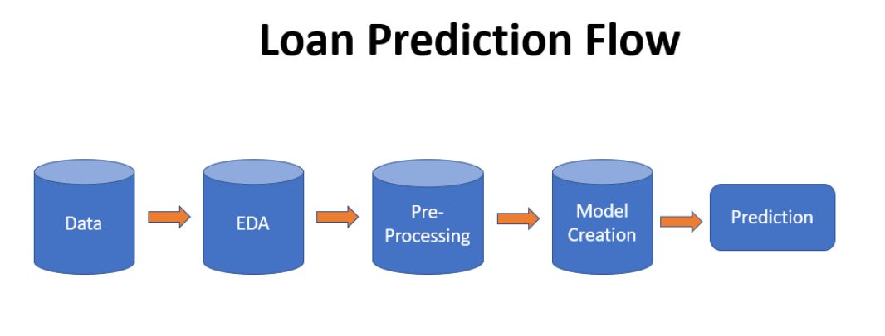

# Loan_Prediction

This is one of the classic machine Learning classification problem where the goal is to predict whether to give loan to a customer or not based on some of the data created by respective company. 

### Data can be downloaded from Kaggle at:  
https://www.kaggle.com/altruistdelhite04/loan-prediction-problem-dataset

<b> Data Files: </b>  
  <t> <i> 1) train.csv : Training data </i></t>  
  <t> <i> 2) test.csv: Test data </i></t>  

## Flow Chart: 
 

 
<b> The steps for creating a model are described below: </b> <i>
  
  a) Load the data from file  
  b) Exploratory Data Analysis  
  c) Handling missing values and dropping irrelavant columns (noise)  
  d) Label Encode and OneHotEncode Columns which contains categories  
  e) Data is ready to inserted into a ML model  
  f) Create a baseline model (i.e. Logistic Regression) to baseline performance  
  g) Use other ML models like (Decision Tree, Random Forest Tree, K-NN, SVM etc)  
  h) Create Confusion matrix for all classifiers, compare the results and see which classifier performed better. </i>

<b> NOTE</b>:  
For this project, I have used publicaly available dataset from Kaggle to learn Machine Learning, Deep Learning and NLP methodologies for personal growth. 
